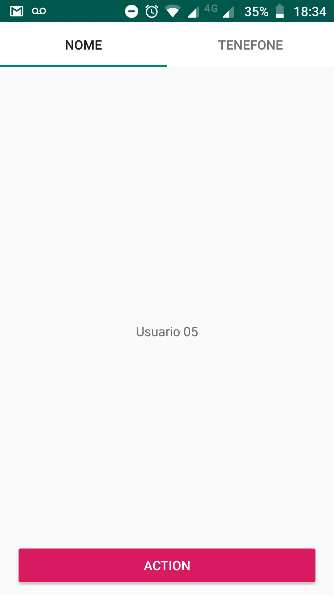

Esta é a tela esta quebrando



Ao clicar no Botão, faço replace do fragment

```kotlin
fun pushFragment(fragment: Fragment) {
    supportFragmentManager.beginTransaction().apply {
        replace(R.id.mainFrlContainer, fragment)
        addToBackStack("HOME")
        commit()
    }
}
```

Colocando um fragment qualquer na tela


Quando volto para tela anterior, o viewPager fica em branco e bugado


[Activity](app/src/main/java/com/example/myapplication/MainActivity.kt)

[RootFragment](app/src/main/java/com/example/myapplication/user/UserFragment.kt)
